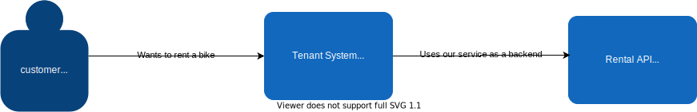
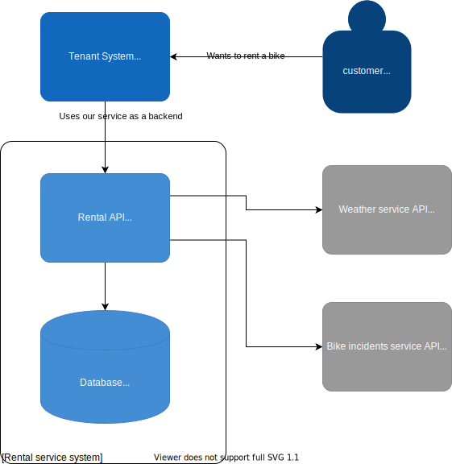

# Business requirements

Build an API for bike rental service.

1. Manage bikes
    1. Add bikes
    2. Update bikes
    3. Remove bikes
    4. Delete bikes
2. Manage bike rentals
    1. Check bike availability
        API user provides:
        - bike id,
        - time from,
        - time to,

        API returns information whether the bike is available or not.
    2. Rent a bike for some amount of time
        API user provides:
        - customer info,
        - bike id,
        - time from,
        - time to,
        - rental location coordinates,

        API returns:
        - On success: full reservation information with its unique id and applied discount amount.
        - On failure: reason of failure (i.e., bike is not available at this time range).
        1. API should calculate the discount for a reservation. Rules for discounting are described later in the specs.
    3. List all reservations for a bike in a given time range.
       1. Reservation list should include canceled ones too.
    4. Cancel reservation
       1. Don't delete data!
    5. Check possible discount
        API user provides:
        - customer info,
        - bike id,
        - time from,
        - time to,
        - rental location coordinates,

        API returns:
        - Value of possible discount

        It shouldn't matter if the bike is available at that time.
3. Discount rules
    1. Discounts for individual customers
        1. Discount on bike weight
            If bike weight >= 15kg, apply 1% discount on each additional kg up to 20%
        2. Discount on weather conditions
            If the temperature at a rental location is less than 10C, apply a 5% discount.
        3. discount on the number of bike incidents in a rental location neighborhood
            If there are 3-4 incidents around a rental location, apply a 5% discount.
            If there are 5 or more incidents around a rental location, apply a 10% discount.
    2. Discounts for business customers
        1. Discount on the reservation value
            If the reservation value is >= 100€, apply a 5% discount
        2. Discount on the reservation time
            If the reservation time is >= 24h, apply a 15% discount
    3. Combining discounts
        If a customer applies to more than 1 discount, choose only one with the highest value.
4. Authentication/Authorization (optional, smaller priority)
   1. Simple authentication (TODO: specify)
   2. No special authorization.

# Initial design

## System context

Our system is supposed to be used by some other tenant system. For simplicity, we assume that they'll work together on the same infrastructure deployed together. Overall context looks like this:

## High-level components

Our system needs to do few things:

1. Manage bikes data
2. Manage reservations data
3. Get weather data (from the external system!)
4. Get bike incidents data (from the external system!)

Bike and reservations data is our internal system state. Overview of high-level components looks like this:

