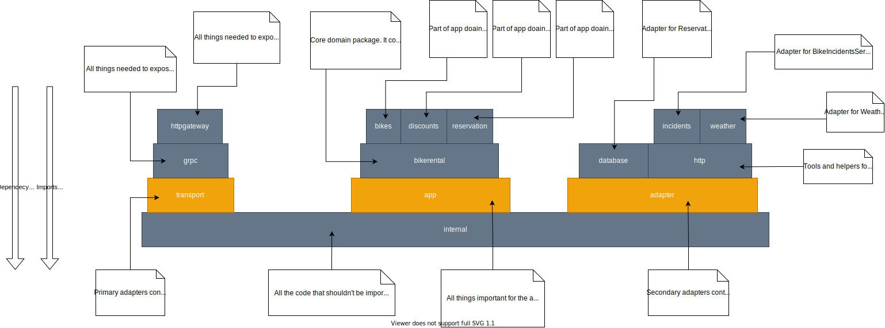
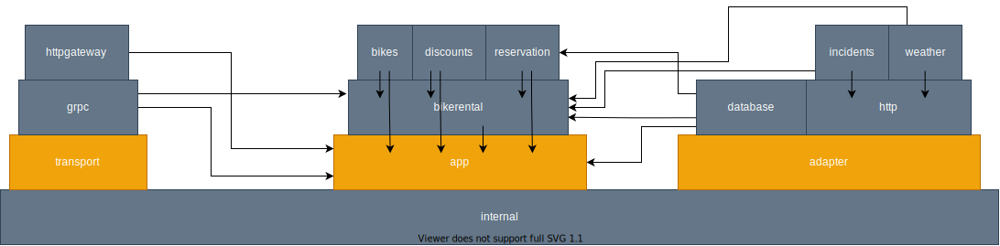

# Package Layout in the example application

*This document builds on [guide to Go packaging](/docs/packages/PACKAGES.md) and [guide to Go app design](/docs/appdesign/DESIGN.md).*

The package structure in an application is a bit different than in libraries. Libraries provide a relatively simple interface for some functionality. In an application we have to:

- implement a "business service",
- implement a way for that service to use external APIs and databases,
- implement an API that exposes that service through the network,

And, on top of that, we have to compile it to the executable file.

In the example application we're proposing package layout, that addresses few problems:

1. Distinguish 3 main layers from "explicit architecture"
2. Have a repeatable repository structure. If we're building multiple applications, we want to have some degree of familiarity between them.
3. Organize packages in a logical way that prevents cyclic imports

## Breakdown of example app's packages

We want to reflect "explicit architecture" somehow in our package structure, and at the same time we want to build on good package practices from the previous guide. So first thing we'll start with is creating a base for our application "core", primary and secondary adapters. We'll create them as `internal` packages, because we don't want the code imported by other repositories (we won't be able to provide a stable interface!).

- `internal/app`
- `internal/transport`
- `internal/adapter`

### internal/app

The package `internal/app` and its sub-packages has to provide a few things.

#### A common language for primary and secondary adapters

##### The **outer core** of the "common language"

Things like:

- How to interpret errors?
- How to log with some additional context
- How to pass trace id through all the calls between app and adapters

##### The **inner core** of the "common language"

The domain. All things related to managing and renting bikes, like:

- What is a Bike/Customer/Reservation?
- How to make a reservation? What is a valid request for creating a reservation? When can a reservation be created, and when it can't?
- How to calculate a discount for a reservation?

If there are multiple, independent "chunks of the domain", we can build them on top of the domain core. That's why the package `internal/app/bikerental/discount` exists and is separated from its parent.

Please bear in mind that in the example app the existence of sub-packages of `internal/app/bikerental` is a bit over-engineered. They are present only to explain the concept of packaging in Go. In reality, this domain is so small that there's no point in splitting it into smaller chunks.

### internal/transport

The package `internal/transport` and its sub-packages provide a way for the outside world to interact with the application. It is responsible for creating a transport that exposes some kind of API.

### internal/adapter

The package `internal/adapter` and its sub-packages provide a way for the application core to communicate with the outside world. It is responsible for:

- Calling external APIs, and adapting their response format to "core" language.
- Managing database connections, managing internal representation of system state in those databases.

Note that in the example app we use 2 REST APIs, so we have 2 adapters:

- `internal/adapter/http/incients`
- `internal/adapter/http/weather`

There's the parent package for them `internal/adapter/http`. It provides a simple way to use REST API. Child packages can build on this simpler abstraction and don't have to deal with HTTP communication details, like building requests, closing response body, decoding responses, etc.

## The packages working together

Here's a visualization of all non-test packages working together. Each package has a description of its responsibility.

Take a look at another diagram with arrows showing imports between packages. 

Note the direction: always down and always towards `app`! 

`app` is the core application logic layer, so any package is free to import it. It's important that it doesn't know anything about our business domain or adapters. It's actually the other way around: business logic code and adapters can use some of the tools from `app`, common to whole application.

`bikerental` and its children are the core domain layer. So all of the packages (except for `app`) can import them.

`transport` and its children expose the application to the world. So it can use some of the common tools from `app`, and also has to know about the domain. So it can import "central column". But it should never care about how our communicates with outside world! So imports from `adapter` is forbidden here.

`adapter` provides means of communication with databases and APIs. It has to import our `app` and domain packages to know how to "adapt" to app interfaces. And similar to previous paragraph, it should never care about how the data adapters provide will be exposed to the world. So import of `transport` is forbidden here.

## External sources

I recommend you [this](https://www.gobeyond.dev/standard-package-layout/) and [this](https://www.gobeyond.dev/packages-as-layers/) articles from Ben Johnson's blog. He describes similar concepts that I think are more suited for small applications. But it's definitely worth reading!
