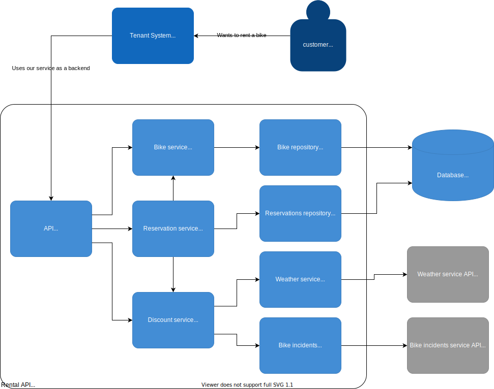

# System design

To fully understand this design, you should take a look at [business requirements](/docs/businessrequirements/requirements.md). If you haven't already, please do it first.

## System context

Our system is supposed to be used by some other tenant system. For simplicity, we assume that they'll work together on the same infrastructure deployed together. Overall context looks like this:

## High-level components

Our system needs to do few things:

1. Manage bikes data
2. Manage reservations data
3. Get weather data (from the external system!)
4. Get bike incidents data (from the external system!)

Bike and reservations data is our internal system state. Overview of high-level components looks like this:

## Components breakdown

We want to identify some components crucial for implementing system functionality. Some important things to note here:

1. We want to organize business logic into smaller "domain chunks".

   This example project is pretty simple, so we could skip that part. But just for the sake of showing how this separation is supposed to be reflected in go packages, we're going to do that.

2. Business logic is completely separate from data access and HTTP/GRPC code

   We want to move code responsible for connecting to external services or databases away from core app packages. This is just SOLID applied in practice. If we want to change the weather data provider, we should be able to do this easily, without any change in core app logic.

3. Business logic shouldn't care about how it is used.
   
   We can expose it by REST API, GRPC API, GraphQL, CLI - it doesn't matter. It shouldn't affect the code in core app packages.

The breakdown into concrete components looks like this:

## Enter "Explicit Architecture"

The reason why components were split the way they were should be clearer when you start thinking about the application as a system interacting with the outside world. There are parts that receive requests. These are transmitted by network using various formats, and they have to be decoded, so our application could understand them. There are also other systems that our application has to interact with. It involves creating specific requests, encoding them, and sending them through the network. But you might agree that encoding some specific request, creating TCP connection, and handling network traffic is not something that we should mix with calculating discounts for our customers. To summarize: we should allow our core application logic to communicate with the outside world in the simplest possible way. And then we should abstract the details to someplace else. This diagram from Herberto Graça's blog will help you understand the concept:
 

I really recommend reading a [series of blog posts](https://herbertograca.com/2017/07/03/the-software-architecture-chronicles/) by Herberto later.

The important thing to see here is that we can distinguish 3 main layers:

- Application core
- Primary adapters (interface for the world to interact with our application)
- Secondary adapters (interface for the application to interact with the outside world)

We can take the previous diagram and organize it into those 3 layers:

### But why so much hassle? I can write my code without this

Here are some benefits of using the presented approach

### Clean and explicit application logic

When you take away all those database queries, API calls, types used only for decoding requests and responses, all that's left is the code that matters the most. It is the "meat" of what the business tells you to do. And if the code is clean and simple, it's also easy to understand and test.

### Separation of code handling databases and external APIs works well in a team

If you have abstracted the details of using external systems, you can easily divide the work among team members. Working on details of communicating with one external system won't affect other people's work.

### Independence of UI

The way your app is used might change. Maybe you're exposing REST API now, and it's fine. But what if frontend guys want GraphQL? Or maybe your API requires authentication, but the business people want you to expose some of the resources with public access?

With explicit architecture it is never a problem. You can add a new "primary adapter" for each of mentioned cases, and it won't affect a byte in core application logic and won't break any existing tests.

### TODO: there's more for sure :)
