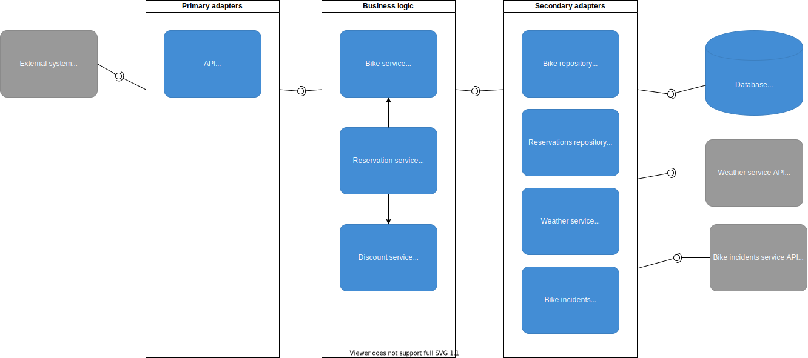

# System design

To fully understand this design you should probably take a look at [business requirements](/docs/businessrequirements/requirements.md). If you haven't already, please do it first.

## System context

Our system is supposed to be used by some other tenant system. Overall context looks like this:

## High level components

Our system needs to do few things:
1. Store bikes data
1. Store reservations data
1. Get weather data (from external system!)
1. Get bike incidents data (from external system!)

So high level view should like this:

## Components breakdown

We want to organize our code into components following clean architecture principles. Some important things to note here:

1. We want to organize business logic into smaller "domain chunks". 

   This example project is pretty simple, so we could skip that part. But just for sake of showing how this separation is supposed to be reflected in go packages, we'll do that.

1. Business logic is completely separate from data access and http/grpc code
   
   We want to move code responsible for connecting to external services or databases away from core app packages. This is just SOLID applied in practice. If we want to change weather data provider, we should be able to do this without any change in core app logic.

1. Business logic shouldn't care about how it is used.
   
   We can expose it by REST API, GRPC API, GraphQL, CLI - doesn't matter. It shouldn't affect the code in core app packages.

Breakdown into concrete components will look like this:

## Enter clean architecture

The reason why components were split down the way they were should be clearer whe you group them in layers.

TODO: Finish this, paste a link to https://herbertograca.com/2017/09/14/ports-adapters-architecture/, describe this somehow

